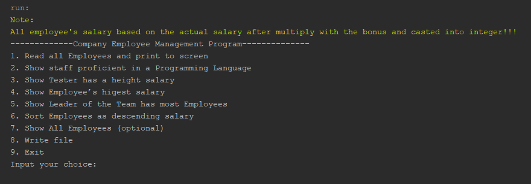

# Project Assignment
## Title 
Employee management in a computer company
## Background
A software company needs to manage employees in the company. In this 
exercise, students will have to implement some components in the employee 
management system. The main objects to be managed are Developers, 
TeamLeader and Testers.
## The system is required to support the following queries
1. Read all Employees and print to screen
2. Show staff proficient in a Programming Language
3. Show Tester has a height salary
4. Show Employee’s higest salary
5. Show Leader of the Team has most Employees
6. Sort Employees as descending salary
7. Write file
    - Req2.txt: result list of staff proficient in C++. 
    - Req3.txt: list of employees with salary > 4,700,000. 
8. Exit
## The following is home menu of this project

